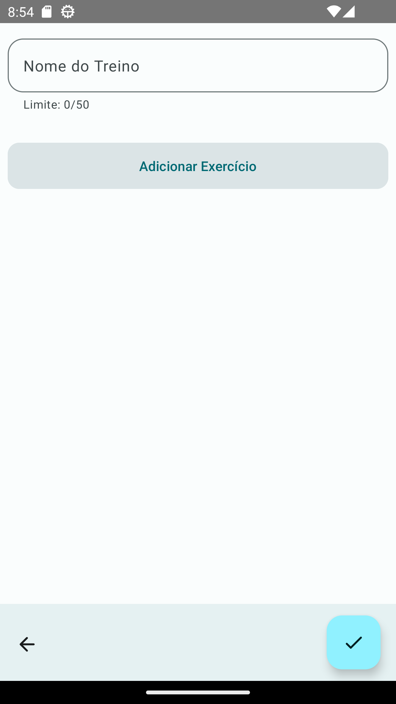
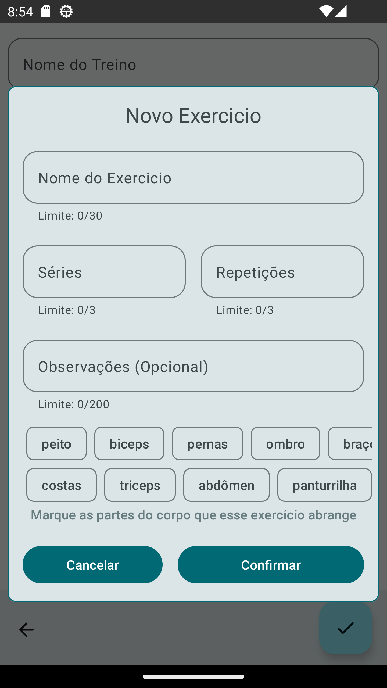
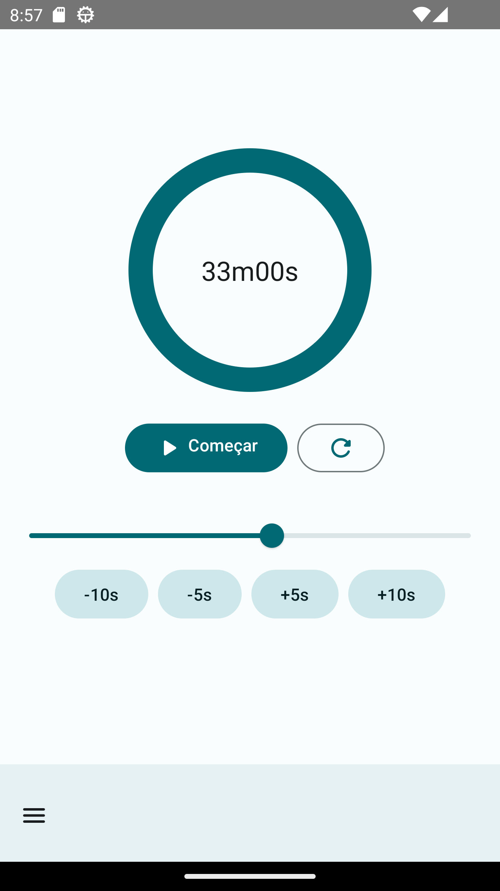
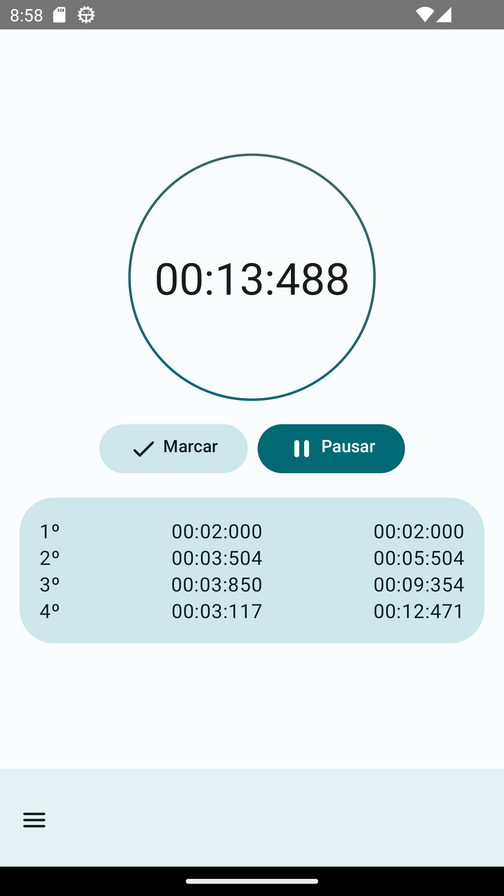

<h1 align="center">GymLog</h1>

  
  
   
  
  

  

🚀 Esse é um projeto de estudos para desenvolvimento Android nativo utilizando a ferramenta Jetpack Compose.

💪 Aplicativo que gerência treinos de acadêmia, oferece também ferramentas como temporizador, cronômetro e calculadora imc com histórico.

## Download
 Faça o download da <a href="https://github.com/LucasMelll0/GymLog/blob/master/apk/GymLog.apk?raw=true">APK diretamente</a>. Você pode ver <a href="https://www.google.com/search?q=como+instalar+um+apk+no+android">aqui</a> como instalar uma APK no seu aparelho android.

## Tecnologias usadas e bibliotecas de código aberto

- Minimum SDK level 26
- [Linguagem Kotlin](https://kotlinlang.org/)

- Jetpack
  - Jetpack Compose: Kit de ferramentas para criar IUs nativas de forma declarativa.
  - Lifecycle: Observe os ciclos de vida do Android e manipule os estados da interface do usuário após as alterações do ciclo de vida.
  - ViewModel: Gerencia o detentor de dados relacionados à interface do usuário e o ciclo de vida. Permite que os dados sobrevivam a alterações de configuração, como rotações de tela.
  - Room: Biblioteca para persistência de dados local.
  - Navigation Component: Para navegação do app.
  - Firebase Auth: para autênticação de usuários.
  - Firebase Firestore: Para armazenamento de dados em nuvem.
  - Firebase Storage: Para armazenar imagem de perfil do usuário.

- Arquitetura
  - MVVM (View - ViewModel - Model)
  - Comunicação da ViewModel com os componentes usando flow.
  - Repositories para abstração da comunidação com a camada de dados.
  
- Bibliotecas
  - [Coil](https://github.com/coil-kt/coil): Para carregamento de imagens e cacheamento das mesmas.
  - [Koin](https://insert-koin.io/): Para injeção de depêndencias.
  - [datastore](https://developer.android.com/jetpack/androidx/releases/datastore?hl=pt-br): Para armazeramento de dados de forma assíncrona.

## Arquitetura
**GymLog** utiliza a arquitetura MVVM e o padrão de Repositories, que segue as [recomendações oficiais do Google](https://developer.android.com/topic/architecture).
  

 
<h2>Authenticação</h2>

 
<h2>Home</h2>

 
<h2>Fomularios</h2>

 
<h2>Calculadora IMC</h2>

 
<h2>Temporizador</h2>

 
<h2>Cronômetro</h2>

 
<h2>Perfil de Usuário</h2>

